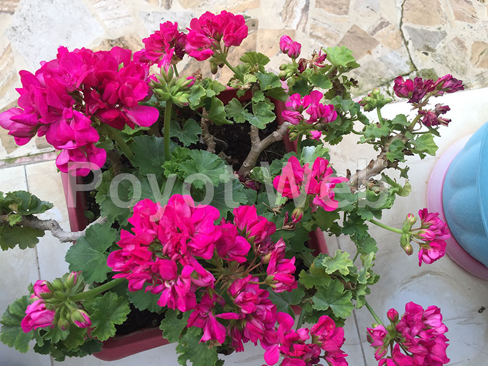

<html>
<head>
<meta charset="utf-8">
<title>Untitled Document</title>
 <link href="gallerystyle.css" rel="stylesheet" >

</head>

<body>
 background= poyot1.jpg;
 

    
        
Poyot 1

    float:left;
    

    

    
Poyot 2

    
</body>
</html>

